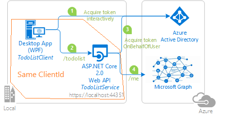

### Overview

This sample presents a Web API running on ASP.NET Core 2.2, protected by Azure AD OAuth Bearer Authentication. The Web API calls the Microsoft Graph, and is called by Angular SPA.
Both applications use the Active Directory Authentication Library [MSAL.NET](https://github.com/AzureAD/microsoft-authentication-library-for-dotnet) to obtain a JWT access token through the [OAuth 2.0](https://docs.microsoft.com/en-us/azure/active-directory/develop/active-directory-protocols-oauth-code) protocol. The desktop application:

1. Acquires an access token for the Web API
2. Calls the ASP.NET Core Web API adding the access token as a bearer token in the authentication header of the Http request. the Web API  authenticates the user using the ASP.NET JWT Bearer Authentication middleware.
3. When the client calls the Web API, the Web API acquires another token to call the Microsoft Graph (3)
4. then the Web API calls the graph

## How to run this sample

### Prerequisites

- [Node.js](https://nodejs.org/en/download/) must be installed to run this sample.
- [Angular-cli](https://cli.angular.io/) must be installed to run this sample.
- [Dotnet Core SDK](https://dotnet.microsoft.com/download) must be installed to run this sample.
- We recommend [VS Code](https://code.visualstudio.com/download) for running and debugging this cross-platform application.
- An Azure Active Directory (Azure AD) tenant. For more information on how to get an Azure AD tenant, see [How to get an Azure AD tenant](https://azure.microsoft.com/documentation/articles/active-directory-howto-tenant/)
- A user account in your Azure AD tenant. This sample will not work with a Microsoft account (formerly Windows Live account). Therefore, if you signed in to the [Azure portal](https://portal.azure.com) with a Microsoft account and have never created a user account in your directory before, you need to do that now.

### Step 1:  Register the sample application with your Azure Active Directory tenant

#### Choose the Azure AD tenant where you want to create your applications

As a first step you'll need to:

1. Sign in to the [Azure portal](https://portal.azure.com) using either a work or school account or a personal Microsoft account.
1. If your account is present in more than one Azure AD tenant, select your profile at the top right corner in the menu on top of the page, and then **switch directory**.
   Change your portal session to the desired Azure AD tenant.

#### Register the ProfileAPI app

1. Navigate to the Microsoft identity platform for developers [App registrations](https://go.microsoft.com/fwlink/?linkid=2083908) page.
1. Select **New registration**.
1. When the **Register an application page** appears, enter your application's registration information:
   - In the **Name** section, enter a meaningful application name that will be displayed to users of the app, for example `ProfileClientAndService`.
   - Change **Supported account types** to **Accounts in any organizational directory and personal Microsoft accounts (e.g. Skype, Xbox, Outlook.com)**.
   - Select **Register** to create the application.
1. On the app **Overview** page, find the **Application (client) ID** value and record it for later.
1. From the **Certificates & secrets** page, in the **Client secrets** section, choose **New client secret**:
   - Type a key description (of instance `app secret`),
   - Select a key duration of either **In 1 year**, **In 2 years**, or **Never Expires**.
   - When you press the **Add** button, the key value will be displayed, copy, and save the value in a safe location.
1. Select the **API permissions** section
   - Click the **Add a permission** button and then,
   - Ensure that the **Microsoft APIs** tab is selected
   - In the *Commonly used Microsoft APIs* section, click on **Microsoft Graph**
   - In the **Delegated permissions** section, ensure that the right permissions are checked: **User.Read**. Use the search box if necessary.
   - Select the **Add permissions** button
   - [Optional] if you are a tenant admin, and agree to grant the admin consent to the web api, select **Grant admin consent for {your tenant domain}**. If you don't do
    it, users will be presented a consent screen enabling them to consent to using the web api.
1. Select the **Expose an API** section, and:
   - Select **Add a scope**
   - Change the Application ID URI to the https pattern, [check AzureADandPersonalMicrosoftAccount restrictions](https://docs.microsoft.com/en-us/azure/active-directory/develop/supported-accounts-validation), (https://{tenant-domain}/{app-name}) and select **Save and Continue**.
   - Enter the following parameters
     - for **Scope name** use `access_as_user`
     - Keep **Admins and users** for **Who can consent**
     - in **Admin consent display name** type `Access ProfileService as a user`
     - in **Admin consent description** type `Accesses the ProfileService Web API as a user`
     - in **User consent display name** type `Access ProfileService as a user`
     - in **User consent description** type `Accesses the ProfileService Web API as a user`
     - Keep **State** as **Enabled**
     - Select **Add scope**

#### Register the ProfileSPA aspect (still in the same app registration)

1. On the app **Overview** page, find the **Application (client) ID** value and record it for later.
1. From the app's Overview page, select the **Authentication** section.
   - Click **Add a platform** button.
   - Select **Web Applications** on the right blade.
   - In the **Redirect URIs** list, add `http://localhost:4200` and check the boxes for ID token and Access Token (i.e. implicit flow).
   - Click **Configure**.
1. Select the **API permissions** section
   - Click the **Add a permission** button and then,
   - Ensure that the **My APIs** tab is selected
   - In the list of APIs, select the `ProfileClientAndService` API, or the name you entered for the Web API.
   - In the **Delegated permissions** section, ensure that the right permissions are checked: **access_as_user**. Use the search box if necessary.
   - Select the **Add permissions** button

### Step 3:  Configure the sample to use your Azure AD tenant

#### Choose which users account to sign in

By default the sample is configured to enable users to sign in with any work and school accounts (AAD) accounts.

##### Important note

`common` is **not** a proper tenant. It's just a **convention** to express that the accepted tenants are any Work or School organizations, or Personal Microsoft account (consumer accounts).

#### Configure the ProfileAPI  project

1. Open the solution in Visual Studio.
1. In the *ProfileAPI* project, open the `appsettings.json` file.
1. Find the `ClientId` property and replace the value with the Application ID (Client ID) property of the *ProfileClientAndService* application, that you registered earlier.
1. Find the `ClientSecret` property and replace the existing value with the key you saved during the creation of the `ProfileClientAndService` app, in the Azure portal.

#### Configure the ProfileSPA project

Note: if you used the setup scripts, the changes below will have been applied for you

1. In the *ProfileSPA* project, open `src/app/app-config.json`.
1. Find the app key `ClientId` and replace the value with the ApplicationID (Client ID) for the *ProfileClientAndService* app copied from the app registration page.
1. and replace the value with the scope of the ProfileClientAndService application copied from the app registration in the **Expose an API** tab, i.e `https://contoso.onmicrosoft.com/TodoListClient-and-Service/access_as_user`.
1. [Optional] If you changed the default URL for your service application, find the app key `resourceUri` and replace the value with the base address of the ProfileAPI project.

### Step 4: Run the sample

Clean the solution, rebuild the solution, and run it.  You might want to go into the solution properties and set both projects as startup projects, with the service project starting first.

When you start the Web API from Visual Studio, depending on the browser you use, you'll get:

- an empty web page (case with Microsoft Edge)
- or an error HTTP 401 (case with Chrome)

This behavior is expected as you are not authenticated. The Angular application will be authenticated, so it will be able to access the Web API.
